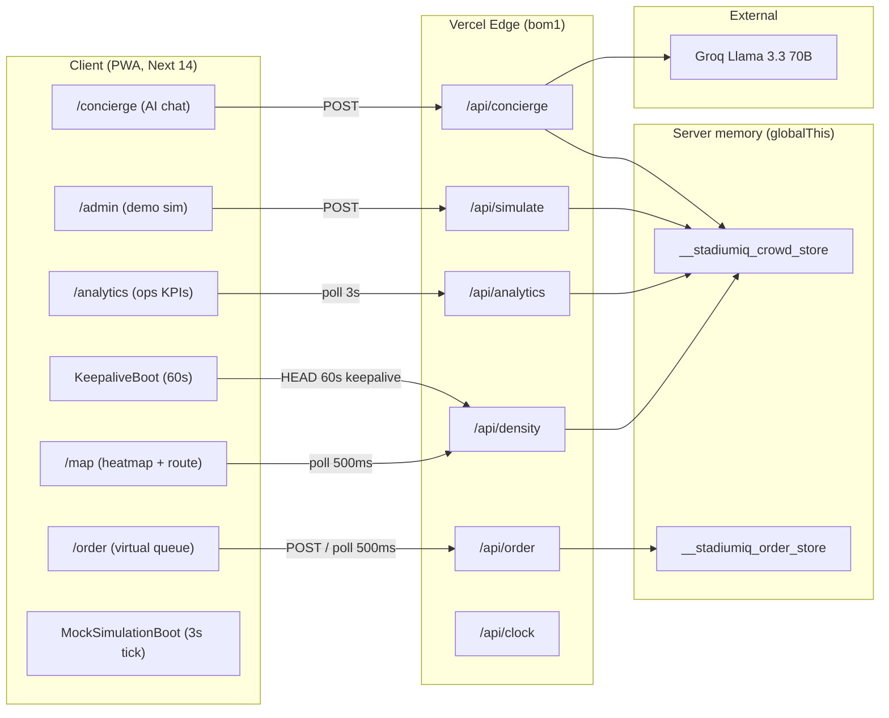
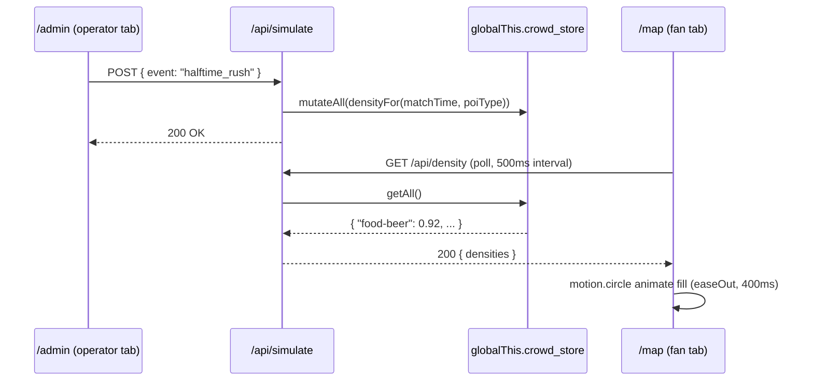
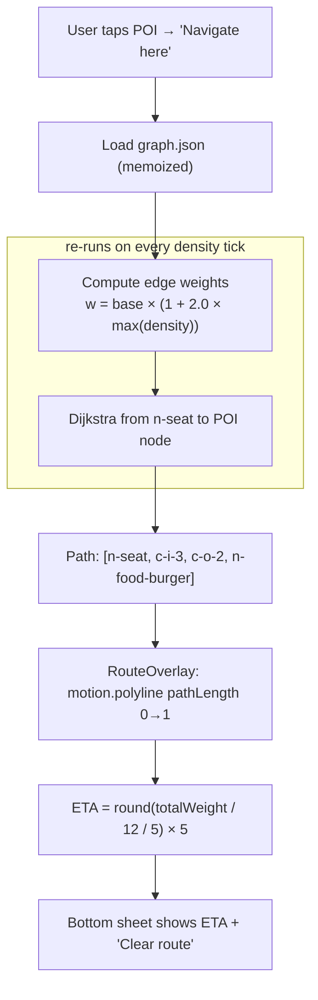
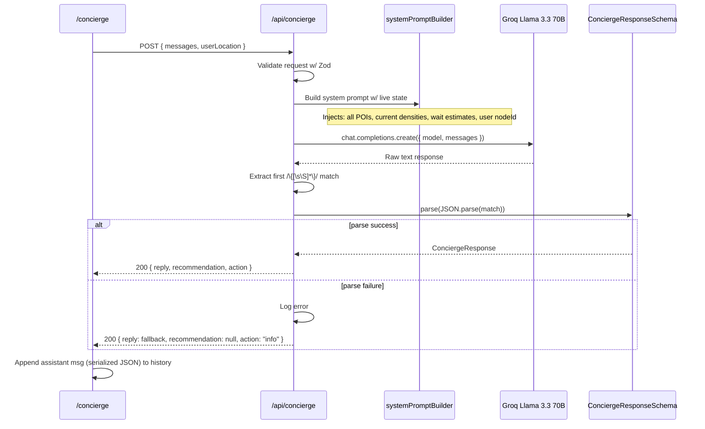
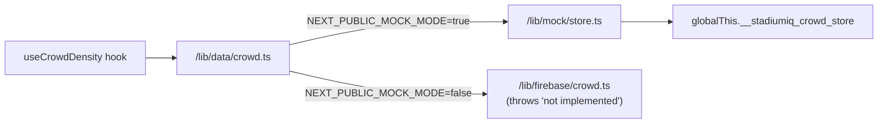
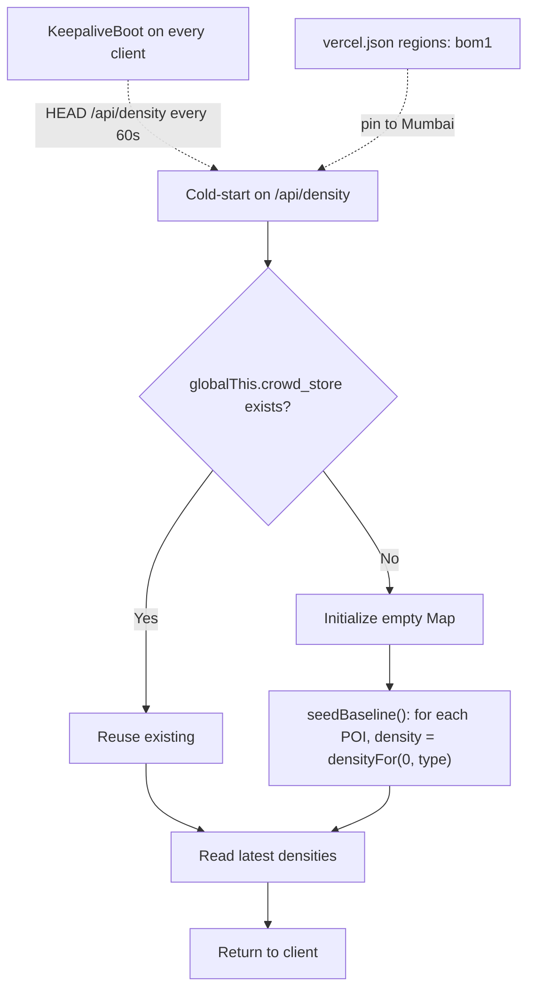
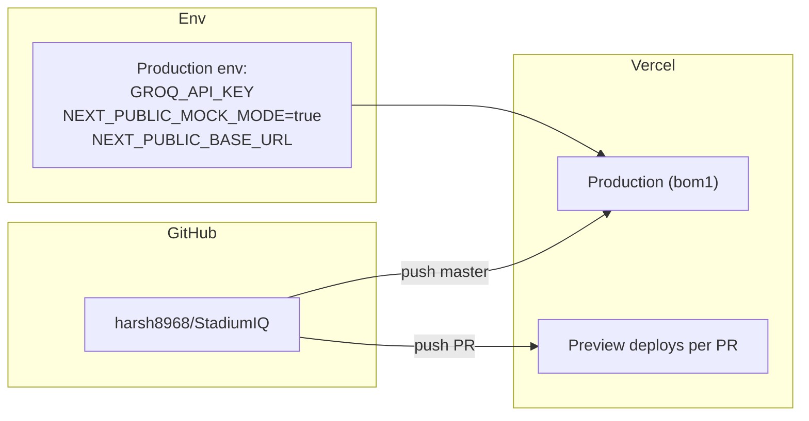

# StadiumIQ — Architecture

> System-level diagrams, data flow, and component responsibilities.
> Read [`TECHNICAL.md`](TECHNICAL.md) for deep-dives on the hard problems.

---

## High-level system

---

## Request flow: admin event → every client sees heatmap change

**Total time from admin click to color change on every open client: ≤500ms poll interval + ~50ms API latency + 400ms animation = ≤1s worst case.** The spec requires 2s. We comfortably beat it.

---

## Routing pipeline

All routing runs **client-side** — the full 40-node graph ships as static JSON (`public/venue/graph.json`, ~3KB gzipped). No server round-trip per recompute.

---

## AI concierge pipeline

**Why two layers of defense (regex + Zod):** models occasionally wrap JSON in markdown fences (`\`\`\`json`), trailing prose, or leading explanations. The regex strips the wrapper. Zod enforces the contract. If either fails, the UI still gets a friendly message — never a 500.

---

## Data-layer abstraction

Components/hooks never import `/lib/mock/*` or `/lib/firebase/*` directly. They go through `/lib/data/*`:

This lets us ship the demo 100% on mock data, and later swap in Firestore without touching a single component. Every data function has the same signature in both branches — the branch is chosen at call-time by the env flag.

---

## State persistence across cold starts

Serverless functions on Vercel cold-start frequently. In-memory state dies between invocations. Three defenses:

1. **Region pin** (`vercel.json`): Every client in India hits the `bom1` region, so we never warm two lambdas in parallel.
2. **KeepaliveBoot**: Production-only `useEffect` that HEAD-pings `/api/density` every 60s. Keeps the lambda warm during the demo window.
3. **Lazy baseline hydration**: First read after cold start seeds every POI to its pre-game baseline density via `densityFor(matchTime=0, poiType)`. No empty-map flash.

---

## Key invariants

| Invariant | Where enforced |
|---|---|
| All POI coords in `1000 × 600` SVG viewBox | `public/venue/pois.json` + `VenueHeatmap` viewBox |
| All routes start at `n-seat` (user seat) | `/lib/routing/index.ts` dijkstra entry point |
| Edge weight penalty cap = 2.0 | `CROWD_PENALTY_MAX` in `/lib/constants.ts` |
| ETA rounded to 5-sec increments | `ROUTING_ETA_ROUND_TO_SEC` in `/lib/constants.ts` |
| Every API input validated via Zod | `/lib/schemas/*.ts` inferred in every route handler |
| Concierge never returns raw LLM text to UI | `structuredChat()` re-raises on parse fail → route catches → friendly fallback |
| Order state machine one-way | `placed → preparing → ready → collected`, `advance()` is a no-op if `collected` |
| Mock store survives HMR | `globalThis._stadiumiq_mock_store` |

---

## Directory responsibilities

| Directory | Owns |
|---|---|
| `/app/(public)` | Landing page — no auth, hero + CTAs |
| `/app/(app)` | Main fan PWA — shares `AppShell` layout |
| `/app/admin` | Demo control plane — intentionally unlinked |
| `/app/api` | Route handlers — all Zod-validated |
| `/components/map` | SVG venue, POI circles, route overlay, bottom sheet |
| `/components/shared` | KeepaliveBoot, MockSimulationBoot, nav, toasts |
| `/components/ui` | shadcn primitives — no business logic |
| `/lib/routing` | Dijkstra + graph parser (memoized) |
| `/lib/mock` | Match timeline, menus, store, wait-time estimator |
| `/lib/data` | Abstraction layer — components go through here |
| `/lib/schemas` | Zod schemas — single source of truth |
| `/lib/claude` | Groq client wrapper + structured output |
| `/lib/constants.ts` | All magic numbers — thresholds, speeds, penalties |
| `/public/venue` | Static SVG + POI + graph JSON |
| `/docs` | Architecture, technical, pitch, demo |

---

## Deployment topology

Function config from `vercel.json`:

- `regions: ["bom1"]` — Mumbai edge.
- All 7 API routes have `maxDuration: 30s` — concierge needs it for first-token latency on cold start.

---

For **why** each of these choices was made (alternatives considered, trade-offs, cost model), see [`TECHNICAL.md`](TECHNICAL.md).
